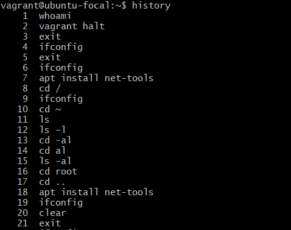
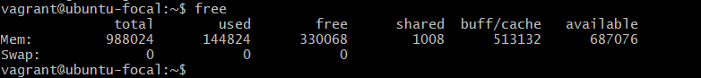
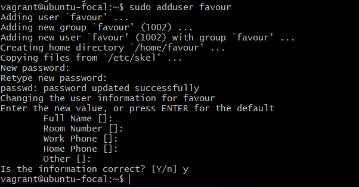
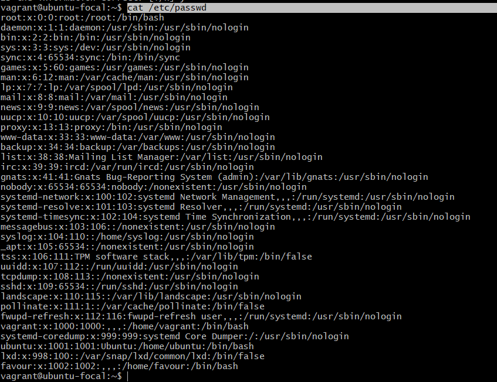
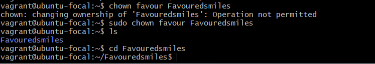
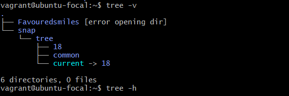
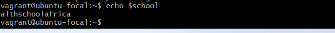
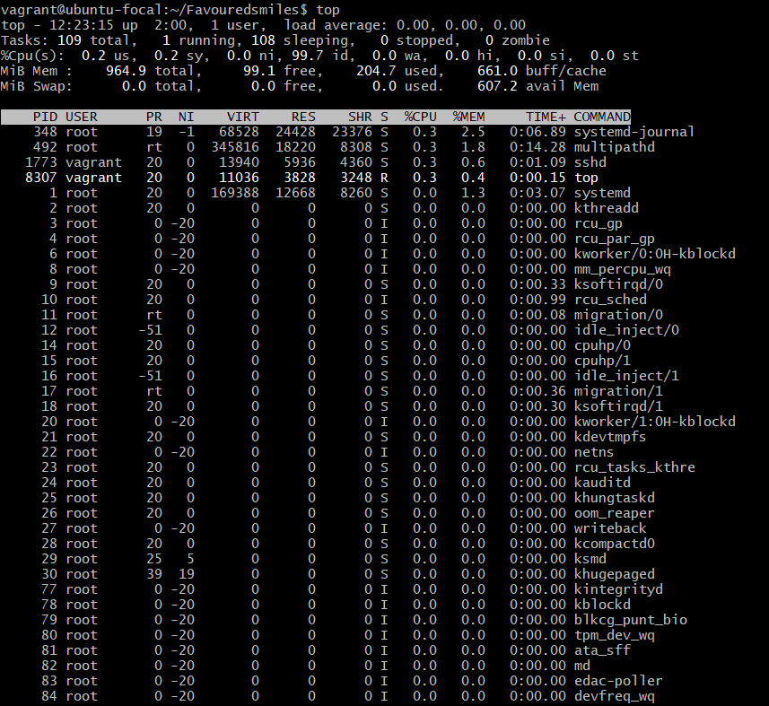
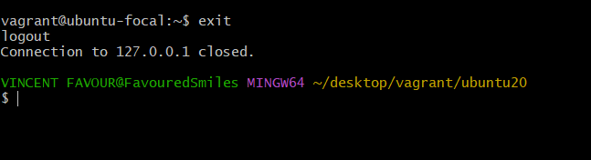
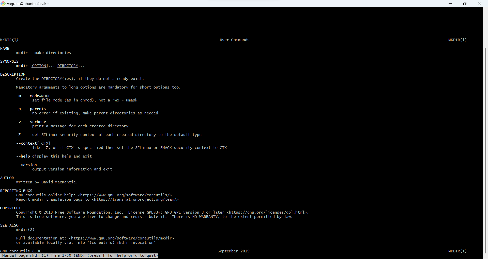

10 linux command with Snapshots
-
1. **history** -	*Gives a list of all past commands typed in the current terminal session*
   

2. **free** -	*Gives free RAM on your system*
   

3. **sudo adduser username** - 	*To add a new userr*
   

4. **cat  /etc/passwd** - *To view all users*

5. **Chown user** -	*For changing the ownership of a file/directory*
   

6. **tree** - *To display the directory structure in a tree-like format*
 

7. **echo $VARIABLE** - 	*To display value of a variable*
   

8. **top** -	*Details on all Active Processes*
 

9. **Exit** - *used to exit the shell where it is currently running*
 

10. **man** -	*Gives help information on a command*
  